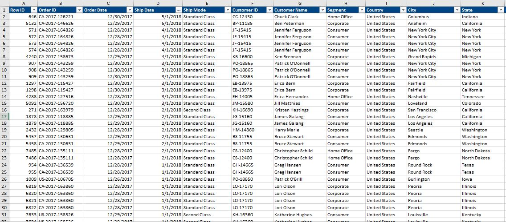
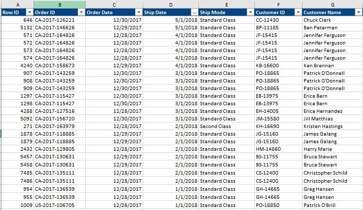
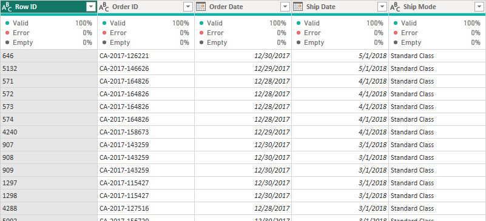
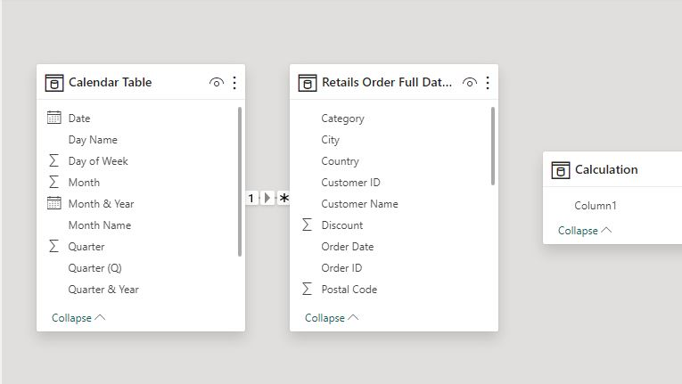
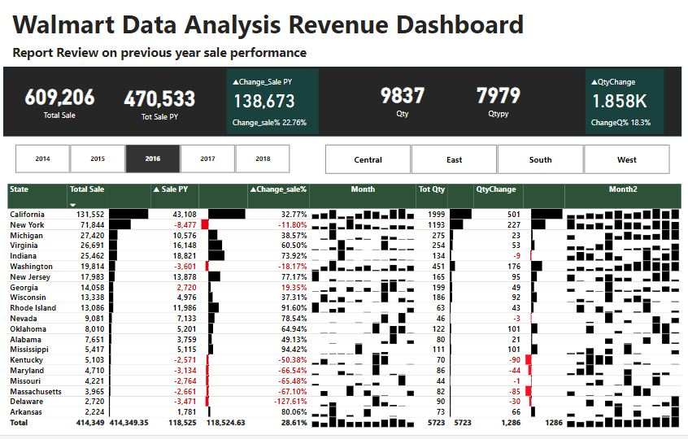
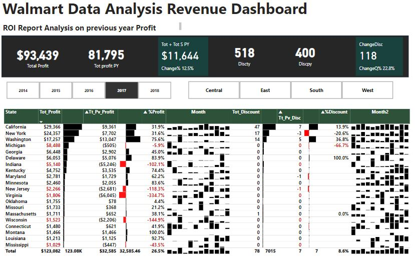
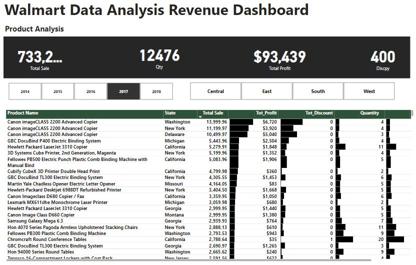
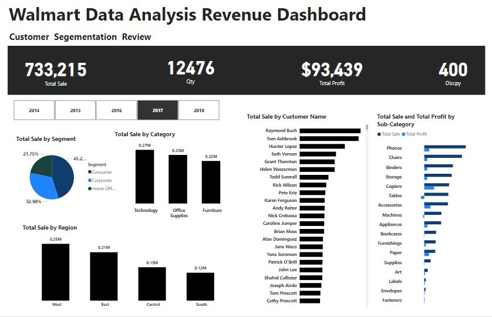

# Optimizing Sales Performance: A Comprehensive Data Analysis for Walmart

Walmart  Store                             |          Analysis  
:-----------------------------------------:|:------------------------:
    | 

## Executive Summary
As a newly hired data analyst at Walmart, my primary task was to analyze our sales data to provide actionable insights that can drive business growth and improve operational efficiency. This report presents a detailed analysis of the sales data, focusing on the importance of data matrices in understanding our business performance. The analysis covers various dimensions such as sales, customer segmentation, shipping details, and product categories.

## Introduction
In my role as a data analyst, I utilized data matrices to organize and analyze sales data, which is crucial for making informed decisions. This report demonstrates how structured data analysis can help Walmart understand its market performance, optimize strategies, and enhance profitability.

## Data Overview

Transaction data                       |          Calendar 
:-------------------------------------:|:------------------------:
                     |    

The dataset includes the following key variables:

- Order Details: Row ID, Order ID, Order Date, Ship Date, Ship Mode
- Customer Information: Customer ID, Customer Name, Segment, Country, City, State, Postal Code, Region, Retail Sales People
- Product Information: Product ID, Category, Sub-Category, Product Name
- Sales Metrics: Returned, Sales, Quantity, Discount, Profit

## Tools and Methodology
Tools Used
- Microsoft Excel: For data organization, analysis, and visualization.
- Power BI: To summarize data and create data matrices for deeper analysis.
- Dax: To calculate totals, averages, and other key metrics.

## Data Transformation

Data cleaning was performed per table.
The table appeared to be clean.
The quality of each column is 100% with no error or nulls.
Below is a preview of the Clean tables and modelling:

Data Cleaning            |           Data Modelling
:--------------------------:|:------------------------:
          |         

## Key Findings

Quantity Dashboard                     |     ROI Analysis
:-------------------------------------:|:------------------------:
                     |       

 Product Analysis                     |  Customer Segementation   
:-------------------------------------:|:-----------------------:
                     |                                            

<h1> <a href="https://app.powerbi.com/view?r=eyJrIjoiZGRhMWZiZTgtY2FiYy00Y2UzLTlkNDItMjRiZDMyZmEzM2NjIiwidCI6ImRmODY3OWNkLWE4MGUtNDVkOC05OWFjLWM4M2VkN2ZmOTVhMCJ9">Dashboard Visualization of the Walmart store Analysis here is a clickable Link to my Power Bi Dashboard. </a>

## 1. Sales Performance by Region

 Central                             |            Region
:-----------------------------------:|:------------------------:
                                        Top Performing Product: GBC DocuBind P400 Electric Binding System
                                        Sales: $5443.96
                                        Profit: $2504.22
                                        Retail Sales Person: Kelly Williams                                           

  East                               |           Region
:-----------------------------------:|:------------------------:
                                        Top Performing Product: Canon imageCLASS 2200 Advanced Copier
                                        Sales: $11199.96
                                        Profit: $3919.98
                                        Retail Sales Person: Chuck Magee              

  West                               |           Region
:-----------------------------------:|:------------------------:
                                        Top Performing Product: Canon imageCLASS 2200 Advanced Copier
                                        Sales: $13999.96
                                        Profit: $6719.98
                                        Retail Sales Person: Anna Andreadi    

  South                              |           Region
:-----------------------------------:|:------------------------:
                                        Top Performing Product: Cubify CubeX 3D Printer Triple Head Print
                                        Sales: $7999.98
                                        Profit: $3839.99
                                        Retail Sales Person: Cassandra Brandow   
                                        
## 2. Customer Segmentation

 Segementation                       |       Segment 
:-----------------------------------:|:------------------------:
                                        Corporate Segment
                                        High Sales: Grant Thornton ($8167.42)
                                        Regions: South
                                        Key Products: Cubify CubeX 3D Printer Triple Head Print
                                        Consumer Segment
                                        High Sales: Raymond Buch ($14,203.28)
                                        Regions: West
                                        Key Products: Canon imageCLASS 2200 Advanced Copier

3. Product Category Analysis

 Product                             |      Category Analysis
:-----------------------------------:|:------------------------:
                                        Technology: Highest volume with products like Phone,copiers,Accesories,machine and fasteners showing consistent sales across regions.
                                        Office Supplies: Includes niche products like Blender Storage, Appliance e.t.c.
                                        Furniture: High-ticket items with significant contributions to sales but varied profit margins e.g chair,table,bookcases e.t.c

4. Return Analysis

 Return                              |       Analysis
:-----------------------------------:|:------------------------:
                                        Products with high return rates include Copiers,Accessories,Phone highlighting Product with low return having potential quality issues or customer 
                                        dissatisfaction e.g fasteners,table,machine and bookcases.

## Conclusion
Key Findings
Regional Performance: The West region, particularly San Francisco, shows high sales and profit margins, suggesting a strong market presence.
Customer Segmentation: The consumer segment drives high sales volumes, especially in the East region, necessitating targeted marketing strategies.
Product Categories: Office supplies dominate sales, but a focus on reducing return rates and enhancing product quality could further boost profits.

## Recommendations
Targeted Marketing: Focus on high-performing regions and customer segments with tailored promotions and advertising.
Product Quality Improvement: Address the return rates for specific products like binders to enhance customer satisfaction.
Optimize Shipping: Evaluate the cost-effectiveness of shipping modes to ensure timely and cost-efficient deliveries.
Importance of Data Matrices
The use of data matrices in this analysis was crucial. By organizing data into structured formats, it becomes easier to extract meaningful insights, identify trends, and make data-driven decisions. This structured approach is essential for large organizations like Walmart to maintain competitive advantage and drive business growth.

By leveraging Excel, pivot tables, and relevant formulas, I was able to provide Walmart with comprehensive insights into sales performance, customer segmentation, and regional trends. This structured approach ensures data-driven decision-making, leading to improved business strategies and growth. As a data analyst, my role is to continue refining these analyses, helping Walmart enhance its market presence and profitability.

Thank                                  | You
:-------------------------------------:|:------------------------:
        |   
